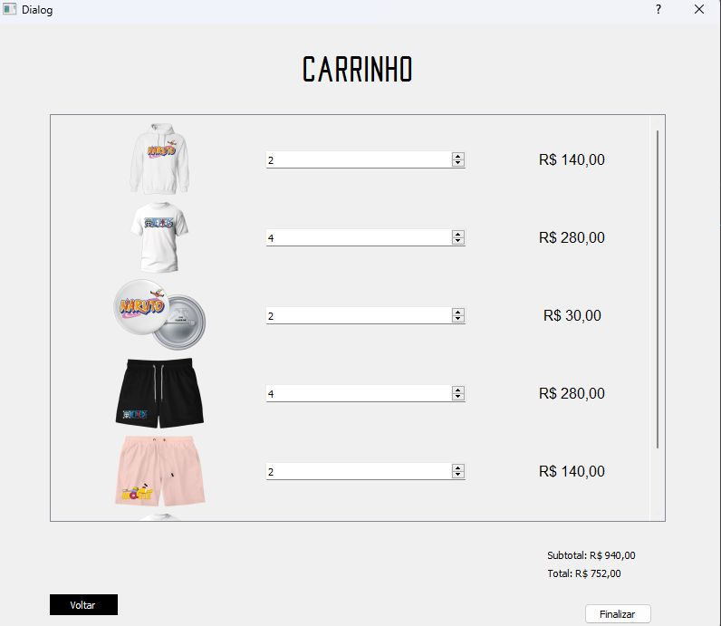

# [Projeto faculdade] Projeto do 1° período da faculdade - Loja de roupas
> **Cadeira:** Laboratório de programação 1  
> **Universidade:** UFRPE - Universidade Federal Rural de Pernambuco  
> **Alunos:** Aécio José e Matheus Costa
-----------------------------------------------------------------------------------------------------------
## Qual a ideia do projeto?
A ideia deste projeto é criar uma loja de roupas em python, para a cadeira de Laboratório de programação 1.  
Para isso, utilizamos a biblioteca PyQt5 para fazer uma UI bonitinha e **bem básica** .

Algumas imagens do projeto:  

  

## Como Rodar?
### Abaixo está o passo a passo de como instalar as bibliotecas e rodar a loja de roupas.

1- Instalar as sequintes bibliotecas: 
PyQt5==5.15.9 
PyQt5_sip==12.12.2 
(como está escrito em requirements) 
este é o comando para instalar no terminal: 
pip install -r requirements.txt 

2- por fim, rodar o "run.py"
